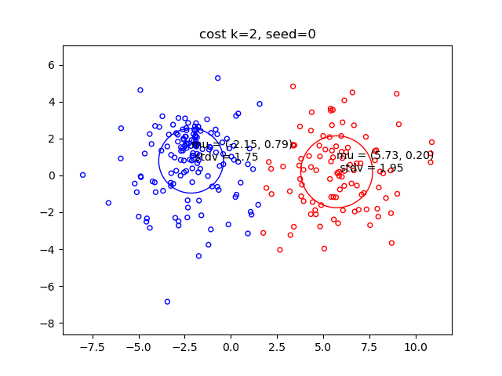
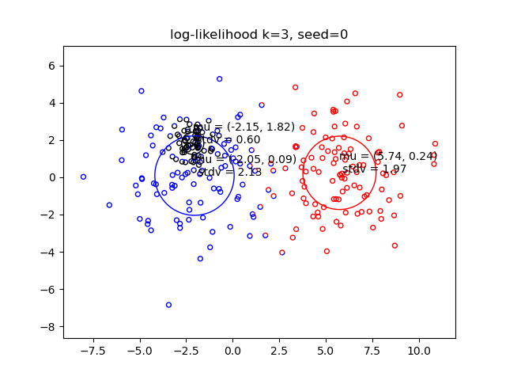
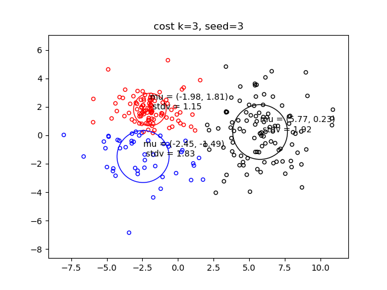
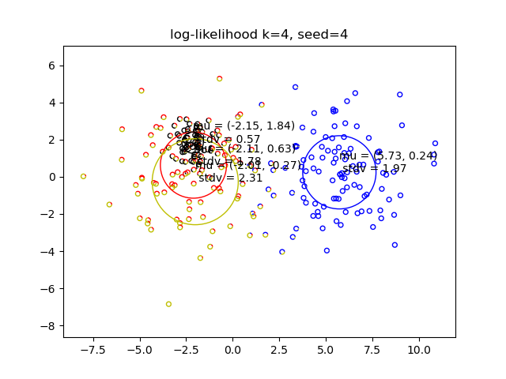
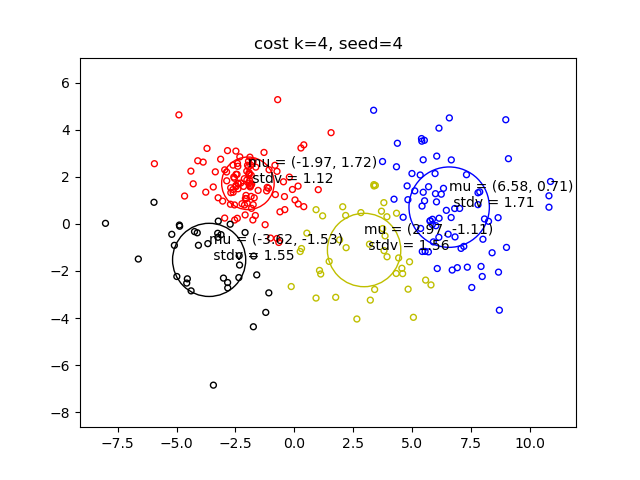

# Overview

A mixture model for collaborative filtering is built.  
Given is a data matrix containing movie ratings made by users where the matrix is extracted from a much larger Netflix database. Any particular user has rated only a small fraction of the movies so the data matrix is only partially filled. The goal is to predict all the remaining entries of the matrix.

# Approach
We assume data is generated from K different Gaussians, so K different types of users. The EM algorithm is used to estimate the mixture from a partially observed rating matrix.

## Project structure

* kmeans → baseline using the K-means algorithm
* naive\_em.py → first version of the EM algorithm
* em.py → mixture model for collaborative filtering
* common.py → common functions for all models
* main.py → runs the code
* test.py → test implementation of EM for a given test case
* toy\_data.txt → a 2D dataset that you will work with in tabs 2-5
* netflix\_incomplete.txt → the netflix dataset with missing entries to be completed
* netflix\_complete.txt → the netflix dataset with missing entries completed
* test\_incomplete.txt → a test dataset to test for you to test your code against our implementation
* test\_complete.txt → a test dataset to test for you to test your code against our implementation
* test\_solutions.txt → a test dataset to test for you to test your code against our implementation

## Results

Fist we will implement the K-means and EM algorithm and compare them on a 2D toy dataset. For this comparison, on each cluster of the K-means algorithm we calculate its mean and variance, so that we assign it to a Gaussian.  
  
  
  
  
  
  

We start seeing differences in the K=3 and K=4 case. In K=3, k-means equally spaces the clusters to minimize the cost. But the EM algorithm has 2 close clusters because it wants to recognize one densely packed cluster on the left, with very different variances. The case is the same for K=4.  
Next, a modified EM algorithm for matrix completion is manually implemented to handle partially filled movie ratings. The E-step is done with a soft assignment via baye's rule and the M step updates the weights to maximize the log-likelihood.  

The root mean squared error of generated data against actual target values is  
**RMSE: 0.4804**. This means that in average, ratings only differ by 0.48 out of 5 against the target values.  

## What I Learned

**Numerical stability**: working with Gaussian likelihoods involves products 
of very small probabilities that would collapse to zero if not handled correctly. 
This project taught me to work in log-space throughout the E-step and apply 
the logsumexp trick for normalization to avoid numerical instabilities.

**Vectorization**: the M-step taught me to replace explicit loops over users 
and clusters with NumPy matrix operations, using boolean masks to 
efficiently handle missing entries. Without correct vectorization, most ML algorithms would not be doable.

## Attribution

This project was completed as part of the MITx MicroMasters program in Machine Learning and Data Science. The problem formulation, dataset, and portions of the code structure were provided by the course. All model implementations and analysis were completed independently.

